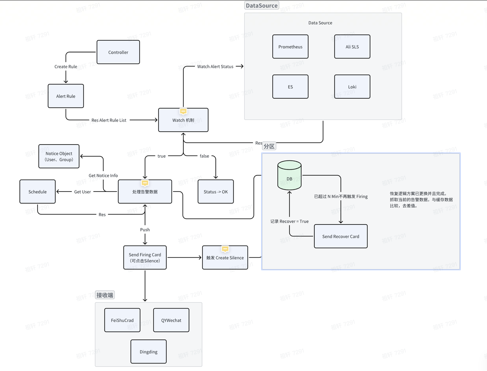

# WatchAlert - 告警系统

# 简介
WatchAlert 是基于 AlertEventMgr（自研）改版后的项目。AlertEventMgr 旨在提供通知功能（包括交互式卡片用于静默、告警复查，通知对象）、值班和聚合功能，替代了 PrometheusAlert 组件，因为 PrometheusAlert 无法满足我们提到的一些需求。

改造后的 WatchAlert 可以完全替代 AlertManager 组件，并且重用了 AlertEventMgr 的交互式通知、通知对象、值班系统和聚合功能。它还独立开发了自己的抑制、告警推送和静默能力。WatchAlert 还负责管理 Prometheus 的Rule规则和自身的配置，与 Prometheus 完全解耦，Prometheus 仅作为数据源使用，不提供其他功能，而所有这些功能都由 WatchAlert 提供。

设计逻辑如下所示：
> 有些逻辑在撰写过程中可能已经发生了变化，但尚未同步到逻辑图中。

