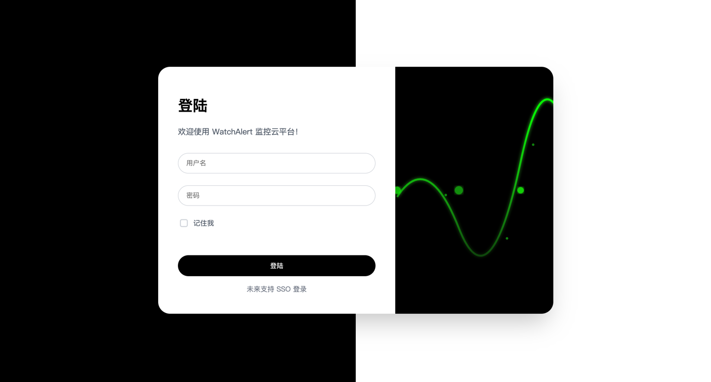
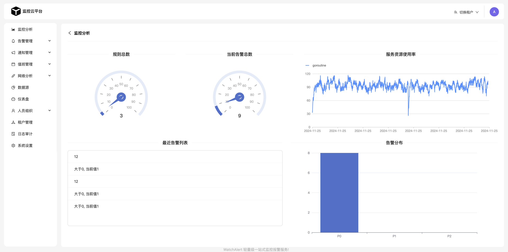
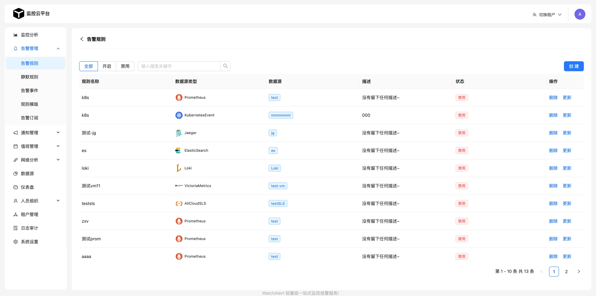
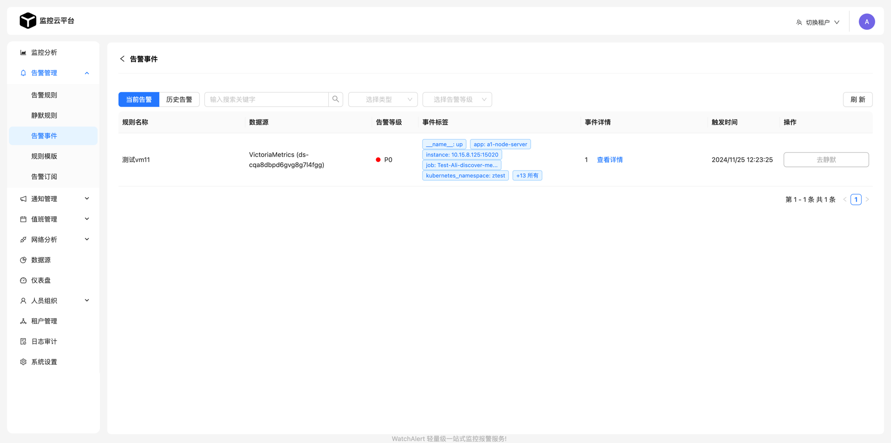
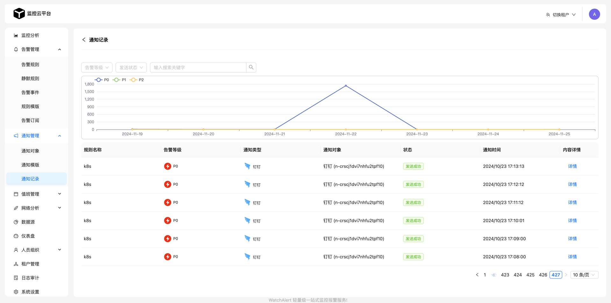
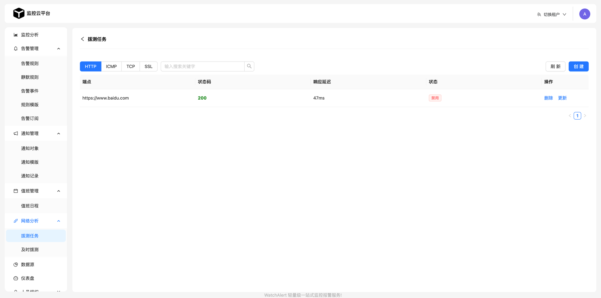
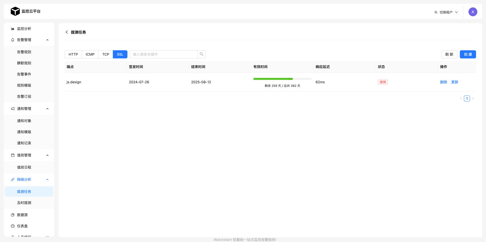
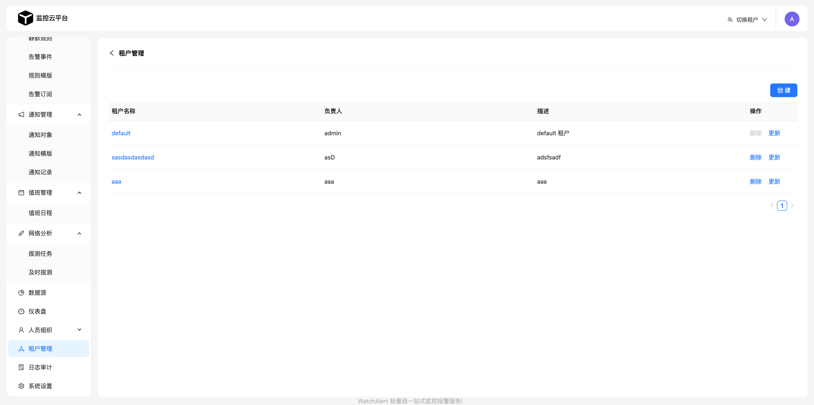
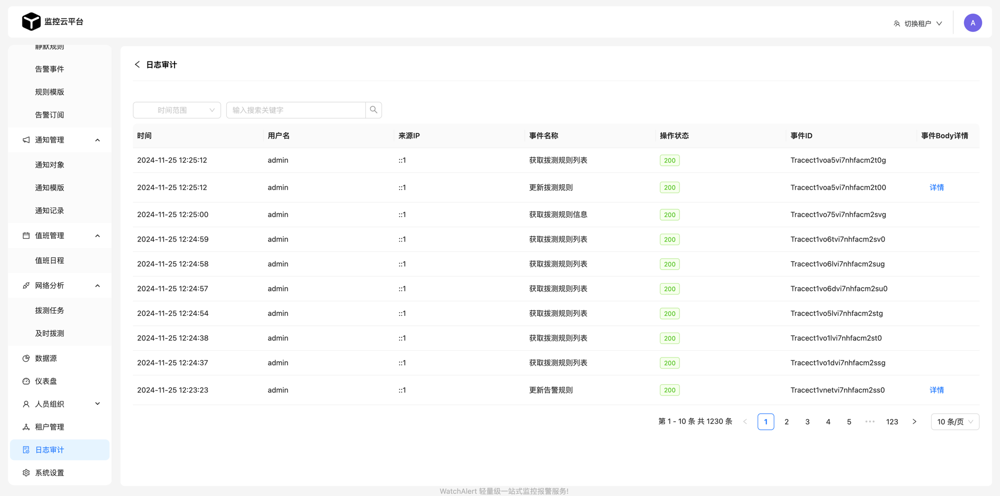

  

  <b>WatchAlert 开源一站式监控告警管理系统</b>

## 💎 项目介绍
WatchAlert 是一款为云原生环境量身打造的轻量级监控告警系统，专注于**可观测稳定性**主题，提供全面的监控与告警支持。

**能力**
- Metrics 监控
    - 集成：Prometheus、VictoriaMetrics
- Logs 监控
    - 集成：Loki、ElasticSearch、阿里云日志服务 (AliCloud SLS)
- Traces 监控
    - 集成：Jaeger
- Events 监控
    - 集成：Kubernetes
- Network 监控
    - 集成：HTTP、ICMP、TCP、SSL

**为什么选择 WatchAlert？**
- 针对云原生环境优化，轻量易用。
- 灵活的告警规则配置，支持多种数据源。
- 专注于稳定性场景，助力快速发现与解决问题。
- 提供稳定可靠的监控告警解决方案，助力用户提升运维效率，降低维护成本。

## 📄 项目文档

- 功能介绍：https://cairry.github.io/docs/
- 快速部署：https://cairry.github.io/docs/install/docker.html

## 🎉 项目预览
- 演示环境：http://8.147.234.89/login
  （admin/123）

|               |                  |
|:------------------------------:|--------------------------------|
|      |  |
|  |  |
|  |  |
|  |  |

## 🎸 支持
- 如果你觉得 WatchAlert 还不错，可以通过 Star 来表示你的喜欢
- 在公司或个人项目中使用 WatchAlert，并帮忙推广给伙伴使用

## 🧑‍💻 交流渠道
- [点击我](https://cairry.github.io/docs/#%E4%BA%A4%E6%B5%81%E7%BE%A4-%E8%81%94%E7%B3%BB%E6%88%91)