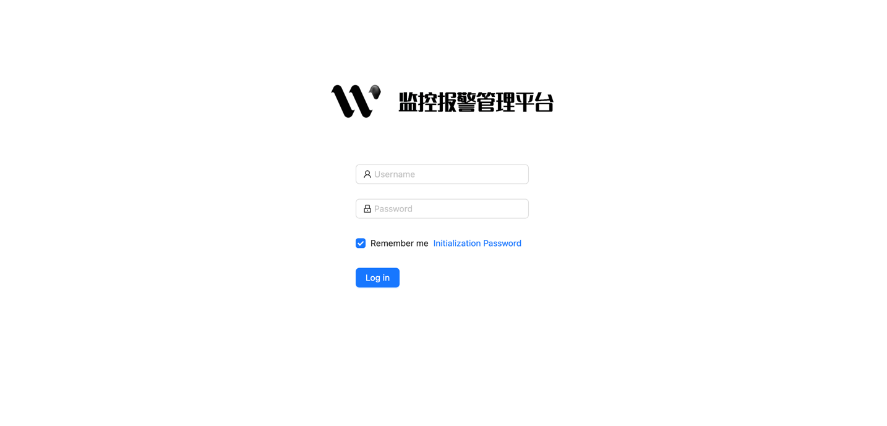
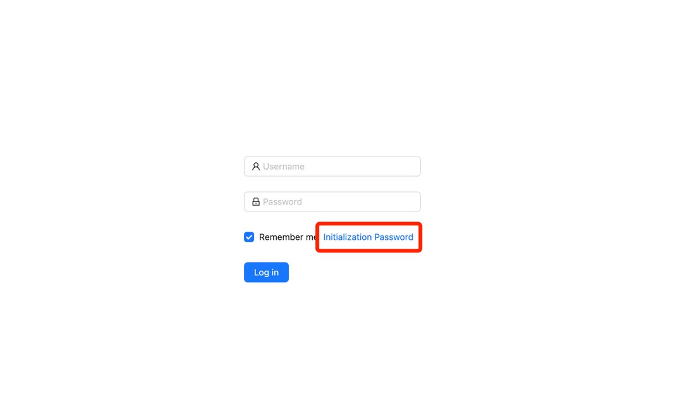

## DockerCompose

- 目录结构
```yaml
[root@master01 w8t]# tree
.
├── config
│   └── config.yaml
└── docker-compose.yaml

1 directory, 2 files
```
- 配置文件
```yaml
Server:
  port: "9001"

MySQL:
  host: w8t-mysql
  port: 3306
  user: root
  pass: w8t.123
  dbName: watchalert
  timeout: 10s

Redis:
  host: w8t-redis
  port: 6379
  pass: ""

Jwt:
  # 失效时间
  expire: 40000
```
- Docker-Compose 启动配置
> 注意：w8t-web 的 command。
>
> REACT_APP_BACKEND_PORT=9001 yarn start
>
> 参数解析：
>
> - REACT_APP_BACKEND_PORT：有特殊需要需要修改后端端口，需要在这里指定后端端口。
```yaml
version: "3"
services:
  w8t-service:
    container_name: w8t-service
    image: docker.io/cairry/watchalert:latest
    environment:
      - TZ=Asia/Shanghai
    volumes:
      - ./config:/app/config
    restart: always
    privileged: true
    ports:
      - "9001:9001"
    depends_on:
      - w8t-mysql
    networks:
      - w8t

  w8t-web:
    container_name: w8t-web
    image: docker.io/cairry/watchalert-web:latest
    environment:
      - TZ=Asia/Shanghai
    restart: always
    privileged: true
    ports:
      - "80:3000"
    entrypoint: ["/bin/sh","-c"]
    command:
      - |
         yarn start

    networks:
      - w8t

  w8t-redis:
    container_name: w8t-redis
    image: redis:latest
    environment:
      - TZ=Asia/Shanghai
    restart: always
    networks:
      - w8t

  w8t-mysql:
    container_name: w8t-mysql
    image: mysql:latest
    ports:
      - "3306:3306"
    environment:
      - TZ=Asia/Shanghai
      - MYSQL_ROOT_PASSWORD=w8t.123
      - MYSQL_DATABASE=watchalert
    restart: always
    networks:
      - w8t

networks:
  w8t:
    driver: bridge
```
- 启动项目
```shell
# docker-compose -f docker-compose.yaml up -d
# docker-compose -f docker-compose.yaml ps
   Name                  Command               State                 Ports              
----------------------------------------------------------------------------------------
w8t-mysql     docker-entrypoint.sh mysqld      Up      0.0.0.0:3306->3306/tcp, 33060/tcp
w8t-redis     docker-entrypoint.sh redis ...   Up      6379/tcp                         
w8t-service   /app/watchAlert                  Up      0.0.0.0:9002->9001/tcp           
w8t-web       /bin/sh -c REACT_APP_BACKE ...   Up      0.0.0.0:80->3000/tcp      
```

- 初始化SQL
> SQL 文件位于项目根目录下./sql/
> 
> notice_template_examples.sql: 通知模版
> 
> rule_template_groups.sql: 告警规则模版组
> 
> rule_templates.sql: 告警规则模版
> 
> user_roles.sql: 用户角色
```shell
# mysql -h xxx:3306 -u root -pw8t.123 --default-character-set=utf8mb4 -D watchalert < notice_template_examples.sql
# mysql -h xxx:3306 -u root -pw8t.123 --default-character-set=utf8mb4 -D watchalert < rule_template_groups.sql
# mysql -h xxx:3306 -u root -pw8t.123 --default-character-set=utf8mb4 -D watchalert < rule_templates.sql
# mysql -h xxx:3306 -u root -pw8t.123 --default-character-set=utf8mb4 -D watchalert < user_roles.sql
```

- 访问页面

先来初始化 admin 用户的密码


